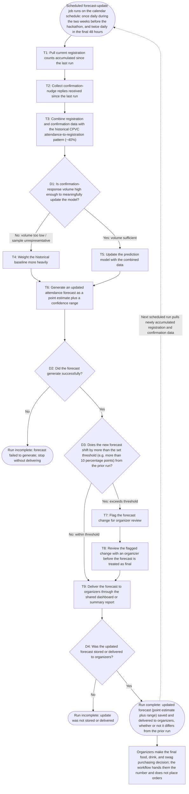

# Workflow of Tasks

*Replace all bracketed prompts with information specific to your proposed system. Delete instructional text that does not belong in your final specification. Add or remove task sections as needed. Every task shown in the general workflow must have a corresponding task specification below.*

## 1. Workflow Overview
### 1.1 Workflow Goal
This workflow supports the system goal defined in `my_first_agent/README.md`.

### 1.2 Workflow Trigger

The workflow begins each time a scheduled forecast-update job runs, once per day during the two weeks leading up to the hackathon (with runs becoming more frequent, such as twice daily, in the final 48 hours). Each run is triggered by the calendar schedule, not by any single registration or reply, and pulls in whatever new registration and confirmation-response data has accumulated since the previous run.

### 1.3 Completion Condition at Runtime

One run is complete when the system has produced an updated attendance forecast, a point estimate plus a range, based on the latest registration and confirmation data, and has saved or delivered that forecast to organizers. This holds whether or not the new forecast differs from the previous run's number. The run is not considered complete if the forecast fails to generate or the update isn't stored/delivered.

### 1.4 General Workflow

In the normal path, the system pulls current registration counts and any confirmation-nudge replies received since the last run, then combines that data with the historical attendance-to-registration pattern from past CPVC events (currently around 40%). It updates its prediction model with this combined data and generates an updated attendance forecast, expressed as a point estimate and a confidence range, then delivers that forecast to organizers through a shared dashboard or summary report.

The most important exception occurs when confirmation-response volume is too low to meaningfully update the model (for example, most participants haven't replied to the nudge yet). In that case, the system falls back to weighting the historical baseline more heavily rather than overreacting to a small, unrepresentative sample. A second exception is a human-review checkpoint: whenever a new forecast shifts by more than a set threshold (for instance, more than 10 percentage points) from the prior run, the system flags the change for an organizer to review before it's treated as final, rather than auto-publishing a volatile number. Organizers always make the final food/drink/swag purchasing decision; the workflow's job is to hand them a reliable, updated number, not to place orders itself.

### 1.5 Workflow Diagram

